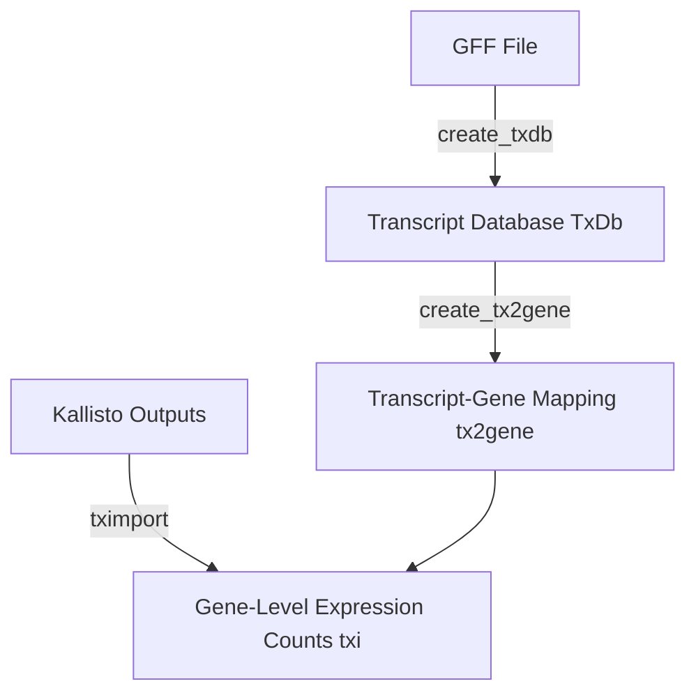

# rnaseq

# RNA-seq Analysis Pipeline

## Repository Structure

```
├── data/
│   └── your_data.gff
├── kallisto_output/
│   ├── sample_1/
│   ├── sample_2/
│   └── ...
├── scripts/
│   ├── txdb_functions.R
│   ├── tximport_functions.R
│   └── validate_exp_design.R
├── results/
│   ├── txdb.RData
│   ├── tx2gene.RData
│   └── txi.RData
└── README.md
```

---

## Workflow Diagram



---

## Commands and Explanations

### 1. Creating Transcript Database (TxDb)

```R
txdb <- create_txdb(gff_file = "data/your_data.gff",
                    organism = "Your Organism",
                    save_path = "results/txdb.RData")
```
**Why:**
Creating a TxDb object from a GFF file standardizes genomic features and annotations. Saving the TxDb improves reproducibility and avoids re-processing the annotation repeatedly.

---

### 2. Loading or Creating TxDb

```R
txdb <- load_or_create_txdb(gff_file = "data/your_data.gff",
                            organism = "Your Organism",
                            db_path = "results/txdb.RData",
                            force_recreate = FALSE)
```
**Why:**
This function efficiently checks for an existing TxDb and loads it, saving computation time unless explicitly forced to recreate, which aids rapid iterative analysis.

---

### 3. Creating Transcript-to-Gene Mapping

```R
tx2gene <- create_tx2gene(txdb, add_prefix = TRUE)
```
**Why:**
Creating a transcript-to-gene mapping (`tx2gene`) is essential for aggregating transcript-level abundances into gene-level counts. Adding a prefix ensures consistent matching with kallisto output.

---

### 4. Importing Kallisto Quantifications

```R
txi <- import_kallisto_to_gene_level(kallisto_dir = "kallisto_output/",
                                     tx2gene = tx2gene,
                                     file_pattern = "abundance.h5",
                                     save_path = "results/txi.RData")
```
**Why:**
Importing transcript-level quantifications into gene-level abundances simplifies downstream analyses such as differential expression. Saving the `txi` object preserves results for future reuse.

---

### 5. Running the Entire Pipeline

```R
pipeline_results <- rnaseq_pipeline(
  gff_file = "data/your_data.gff",
  organism = "Your Organism",
  kallisto_dir = "kallisto_output/",
  output_dir = "results",
  add_prefix = TRUE,
  force_recreate = FALSE
)
```
**Why:**
Combining all steps into one pipeline function promotes reproducibility, ensures standardized outputs, and automates handling of file paths and object creation.

---

### 6. Validating Experimental Design

```R
validate_exp_design(exp_design = your_exp_design_dataframe)
```
**Why:**
Proper experimental design validation ensures robustness, detects issues such as duplicate samples, missing information, or imbalance, and guides the setup of subsequent statistical analyses.

---
